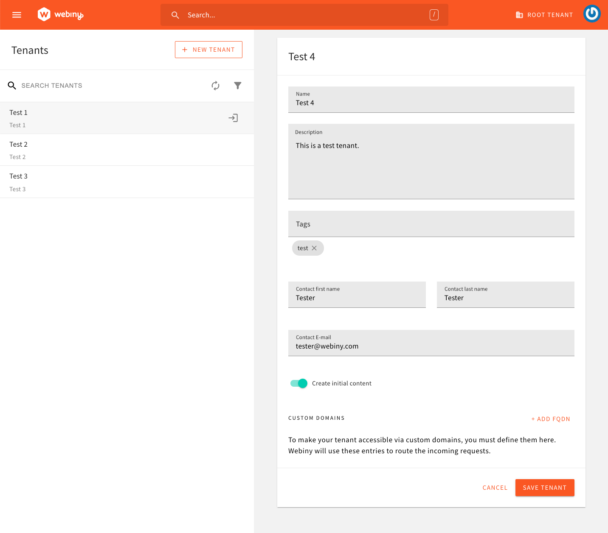

# Extending Tenants Example

This examples shows how to extend Tenant records with additional settings fields.

As seen in the screenshot, we start of by adding new fields to the Tenants form:

- Contact first name
- Contact last name
- Contact E-mail
- Create initial content

This can be achieved via the `AddTenantFormField` plugin, located in the [`apps/admin/src/plugins/TenantExtraSettings.tsx`](./apps/admin/src/plugins/TenantExtraSettings.tsx#L71-L74) file.

As the next step, we ensure our GraphQL API's schema also contains thew newly added fields. We do that via the [`GraphQLSchemaPlugin`](https://github.com/webiny/webiny-js/blob/v5.11.0/packages/handler-graphql/src/plugins/GraphQLSchemaPlugin.ts#L10) plugin in the [`apps/api/graphql/src/plugins/tenantExtraSettings.ts`](./apps/api/graphql/src/plugins/tenantExtraSettings.ts) file.

Finally, as an extra piece of functionality, we hook onto the [`onAfterTenantCreate`](./apps/api/graphql/src/plugins/tenantExtraSettings.ts#L33-L43) lifecycle event, and inspect the value of the `settings.createInitialContent` field. If the value is set to `true`, then we do a simple `console.log` call. But, of course, ultimately a more complex piece of logic could be introduced here.