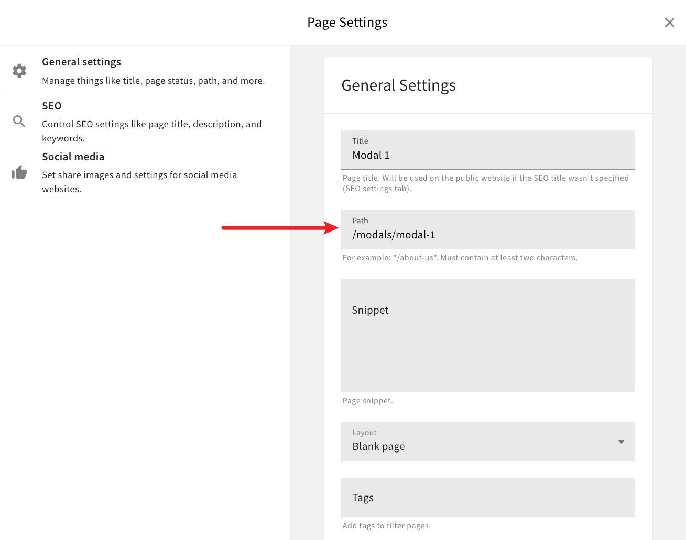

# Pages as Modal Content Example

This examples shows how to use Page Builder and its page designing capabilities to design content for one or more modals that are ultimately displayed on the public website. Think of newsletter signup, special deals, or similar types of modals (we could also call these popups).

For example, in the following screenshot, on the left, we can see a page with a heading, paragraph, and an image being designed in the page editor. On the right side, we can see the designed page being rendered as a content of a modal that's displayed on the public website.

In order to accomplish this, we've performed the following steps.

For starters, as seen in the above screenshot, we've designed a rather simple page in Page Builder's page editor. Once designed, via page settings, we've set its path to `/modals/modal-1`.

We did because, down the line, this will allow us to easily retrieve the page we want to display on the public website (more on this below).

One other thing to notice in the above page settings screenshot is that, instead of **Static page**, we've assigned **Blank page** as the page layout. 

This is a new page layout ([`apps/theme/layouts/pages/Blank.tsx`](./apps/theme/layouts/pages/Blank.tsx)) that we've introduced as part of this example. Essentially, it's a layout that doesn't render any surrounding HTML. This is needed because, once we get to rendering page content in a modal, we don't want any extra HTML in it, apart from the actual page content. We've created this layout in the [`apps/theme/layouts/pages`](./apps/theme/layouts/pages) folder and then registered it in the [`apps/theme/index.ts`](./apps/theme/index.ts) entrypoint file.  

With these initial steps in place, we proceeded by creating the [`Modals`](./apps/theme/layouts/pages/components/Modals.tsx#L42-L73) React component, which does the following.

1. Via Webiny's GraphQL API, retrieves the page and its content. For this example, we've hardcoded the `/modals/modal-1` path of the page that is being retrieved, but, naturally, this logic can be designed in a more robust fashion.
2. Renders the modal content (retrieved page) via the `Page` React component, imported from the core [`@webiny/app-page-builder-elements`](https://github.com/webiny/webiny-js/tree/dev/packages/app-page-builder-elements) package.

For data fetching, we've used the preconfigured Apollo client and its `useQuery` React hook.